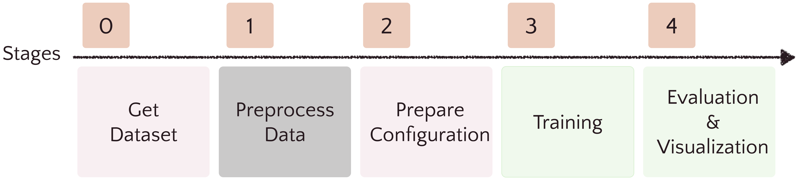

# PyNeuralFx


A toolkit for neural audio effect modeling. Users can conduct experiments conveniently with this toolkit for audio effect modeling. 

[PyNeuralFx paper](https://arxiv.org/abs/2408.06053) 

[Powered by PyNeuralFx]
* [Hyper Recurrent Neural Network: Condition Mechanisms for Black-box Audio Effect Modeling](https://arxiv.org/abs/2408.04829)

## Installation

You can install PyNeuralFx via 
```bash
$ pip install pyneuralfx
```

By using the frame work, you cam 
```bash
$ git clone https://github.com/ytsrt66589/pyneuralfx.git
```
then 
```bash 
$ cd frame_work/ 
```

## Motivation 
Due to the rising importance of the audio effect related task, several easy-to-use toolkits are developed. For example, `dasp-package` ([repo_link](https://github.com/csteinmetz1/dasp-pytorch/tree/main)) for differetntiable signal processing in pytorch and `grafx` ([ref_link](https://github.com/sh-lee97/grafx)) for audio effect processing graph in pytorch. However, there is no easy-to-use toolkit for neural audio effect modeling task, especially for the black-box method. PyNeuralFx aims to overcome this issue, helping beginners easily start the neural audio effect modeling research and inspiring experienced researchers with different aspects. 

## Tutorials 

You can find out the tutorial in `/tutorials`. 

- [Getting started](./tutorials/0_GettingStarted.ipynb)

## Functionality 

### Neural Network Models 
PyNeuralFx follows the naming principles: [**control-model**]
For example, if we use the concat as the conditioning method and the gru as the model, then the model called: **Concat-GRU**.
If the model is only for snapshot modeling, then the **control** will always be **snapshot**

PyNeuralFx supports: 
#### snaoshot modeling 
* [x] snapshot-tcn 
* [x] snapshot-gcn 
* [x] snapshot-vanilla-rnn 
* [x] snapshot-lstm 
* [x] snapshot-gru
* [ ] snapshot-tfilm-gcn ([ref_link](https://arxiv.org/pdf/2211.00497)) 
* [ ] snapshot-tfilm-tcn ([ref_link](https://arxiv.org/pdf/2211.00497)) 

#### full modeling 
* [x] concat-gru
* [x] film-gru
* [x] statichyper-gru
* [x] dynamichyper-gru
* [x] concat-lstm
* [x] film-lstm
* [x] statichyper-lstm
* [x] dynamichyper-lstm
* [x] film-vanilla-rnn
* [x] statichyper-vanilla-rnn
* [x] concat-gcn
* [x] film-gcn
* [x] hyper-gcn
* [x] concat-tcn
* [x] film-tcn
* [x] hyper-tcn
* [ ] film-ssm ([ref_link](https://arxiv.org/pdf/2403.16331))


### Loss functions 
In our opinion, loss functions often aim for different purposes. Some are for the reconstuction loss (**Overall reconstruction**), some are for eliminateing specific problems (**Improving sound details**), and some are for leveraging perceptual properties (**Aligning human perceptual**). More research are needed for the exploration of the loss of different audio effects.


PyNeuralFx supports: 
* [x] esr loss 
* [x] l1 loss 
* [x] l2 loss 
* [x] complex STFT loss 
* [x] multi-resolution complex STFT loss 
* [x] STFT loss 
* [x] multo-resolution STFT loss 
* [x] dc eliminating loss 
* [ ] shot-time energy-loss ([ref_link](https://dafx2020.mdw.ac.at/proceedings/papers/DAFx20in22_paper_35.pdf))
* [ ] adversarial loss ([ref_link](https://arxiv.org/abs/2406.15751), [ref_link](https://arxiv.org/abs/2211.00943))


Also, PyNeuralFx supports 
* [x] pre emphasize filter ([ref_link](https://arxiv.org/abs/1911.08922)) 

### Evaluation metrics 

The loss functions used above can be used as the evaluation metric also, for estimation the **reconstruction error**. Moreover, PyNeuralFx also supports other metrics for comprehensive evaluation: 

* [x] Loudness error ([ref_link](https://github.com/csteinmetz1/pyloudnorm))
* [x] Transient reconstruction ([ref_link](https://arxiv.org/abs/2408.04829))
* [x] Crest factor ([ref_link](https://arxiv.org/abs/2207.08759))
* [x] RMS energy ([ref_link](https://arxiv.org/abs/2207.08759))
* [x] Spectral centroid ([ref_link](https://arxiv.org/abs/2207.08759))
* [ ] signal-to-aliasing noise ratio (SNRA) ([ref_link](https://www.arxiv.org/abs/2406.06293))
* [ ] signal-to-harmonic noise ratio (SNRH) ([ref_link](https://www.arxiv.org/abs/2406.06293))

**Notice** 
Due to the original implementation of the transient extraction is slow, we implement another implementation of the transient extraction. Users can experiment with those two methods and compare the difference. 
### Visualization 

PyNeuralFx supports two types of visualization: 
* Wave file comparison 
    * [x] time-domain wave comparison 
    * [x] spectrum difference 
* Model's behavior visualization 
    * [x] harmonic response 
    * [x] distortion curve 
    * [x] sine sweep visualization (for observing the aliasing problem)
    * [ ] phase response 

## Training Frame Work Usage Flow 



(First run the command `cd frame_work`. Ensure that the working directory is `frame_work`)

0. Download dataset: Download dataset from the commonly used academic paper or prepare the dataset by yourself. Then put the data under the folder  ```data```. Current supported dataset is listed below sections, for the supported dataset, we provide the preprocess file to match the data template we expected. 
1. Preprocess data: Write your own code or manually to match the data template we expected for using the frame work provided in pyneuralfx. Please refer to [dataset.md](./docs/dataset.md) section for more details. If you use the dataset pyneuralfx supported then the preprocess file is already provided in ```preprocess/{name_of_the_dataset}.py```. 
2. Prepare Configuration: modify the configuration files in `configs/`. All experiments are record by configuration file to ensure the reproducibility. Further detail of configuration setting is shown in  [configuration.md](./docs/configuration.md).
3. Training: run the code to train the model depends on the configuration files. Please refer to [train.md](./docs/train.md) for more details. 
4. Evaluation & Visualization: evaluate your results by several metrics or visualize the comparison or important system properties. Please refer to [evalvis.md](./docs/evalvis.md) for more details. 

**Tricks** 
1. During training, you can use ``loss_analysis/compare_loss.py`` to check to validation loss curve. (Remember to modify the experiment root in compare_loss.py)

## Supported Dataset 

* [ ] LA2A Compressor [downlod link](https://zenodo.org/records/3824876#.YyMaiOxBzUI), [paper link](https://arxiv.org/abs/1905.11928)

* [ ] Marshall JVM 410H (Guitar Amp) [downlod link](https://zenodo.org/records/7970723), [paper link](https://www.dafx.de/paper-archive/2023/DAFx23_paper_52.pdf)
* [ ] Boss OD-3 Overdrive [download link](https://drive.google.com/file/d/1y3iQH94dAZbRgP33Pt4lJakgolvV7Xal/view?usp=sharing), [paper link](https://arxiv.org/abs/2408.04829) 
* [ ] EGDB Guitar Amp Dataset [download link](https://drive.google.com/drive/folders/1h9DrB4dk4QstgjNaHh7lL7IMeKdYw82_), [paper link](https://arxiv.org/abs/2202.09907)
* [ ] Compressor Datasets [download link](https://github.com/RiccardoVib/CONDITIONED-MODELING-OF-OPTICAL-COMPRESSOR?tab=readme-ov-file), [paper link](https://www.dafx.de/paper-archive/2023/DAFx23_paper_10.pdf)
* [ ] EGFxSet [download link](https://zenodo.org/records/7044411), [project link](https://egfxset.github.io/), [paper link](https://archives.ismir.net/ismir2022/latebreaking/000006.pdf)
* [ ] Time-varying audio effect [download link](https://zenodo.org/records/7271558#.Y2I_6OzP0-R), [paper link](https://arxiv.org/abs/2211.00497)

Those datasets are collected from previous works, if you use them in your paper or in your project, please cite the corresponding paper. 

## To-do 
* [ ] Support [auraloss function](https://github.com/csteinmetz1/auraloss) 
* [ ] Support DDSP-based neural audio effect modeling architecture 
* [ ] Support more datasets as default 
* [ ] Support analysis of computation cost
* [ ] Adding tutorial about full-modeling scenario 
* [ ] Adding tutorial about effect-chain modeling 
* [ ] Support more pre-trained models on several audio effects  

## Contributing

Interested in contributing? Check out the contributing guidelines. Please note that this project is released with a Code of Conduct. By contributing to this project, you agree to abide by its terms.

## License

`pyneuralfx` was created by yytung. It is licensed under the terms of the MIT license.

## Credits

`pyneuralfx` was created with [`cookiecutter`](https://cookiecutter.readthedocs.io/en/latest/) and the `py-pkgs-cookiecutter` [template](https://github.com/py-pkgs/py-pkgs-cookiecutter). 

This project is highly inspired by the following repositories, thanks to the amazaing works they have done. If you are interested in the audio effect related works, please look at the following repositories or websites to gain more insights. 

* micro-tcn ([link](https://github.com/csteinmetz1/micro-tcn))
* gcn-tfilm (([link](https://github.com/mcomunita/gcn-tfilm/tree/master)))
* pyloudnorm ([link](https://github.com/csteinmetz1/pyloudnorm))
* ddsp-singing-vocoder ([link](https://github.com/YatingMusic/ddsp-singing-vocoders/tree/main))
* Binaural Speech Synthesis ([link](https://github.com/facebookresearch/BinauralSpeechSynthesis))
* GreyBoxDRC ([link](https://github.com/Alec-Wright/GreyBoxDRC))
* sms-tools ([link](https://github.com/MTG/sms-tools))
* DeepAFx-ST ([link](https://github.com/adobe-research/DeepAFx-ST))
* Audio DSPy ([link](https://github.com/jatinchowdhury18/audio_dspy/tree/master))
* Jatin Chowdhurry medium ([link](https://jatinchowdhury18.medium.com/))
* Hyper LSTM ([link](https://nn.labml.ai/hypernetworks/hyper_lstm.html))
* GuitarML ([link](https://guitarml.com/))
* SFI source separation ([link](https://github.com/TomohikoNakamura/sfi_convtasnet))
