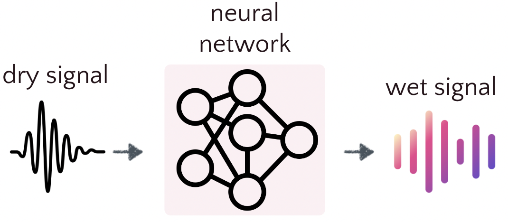
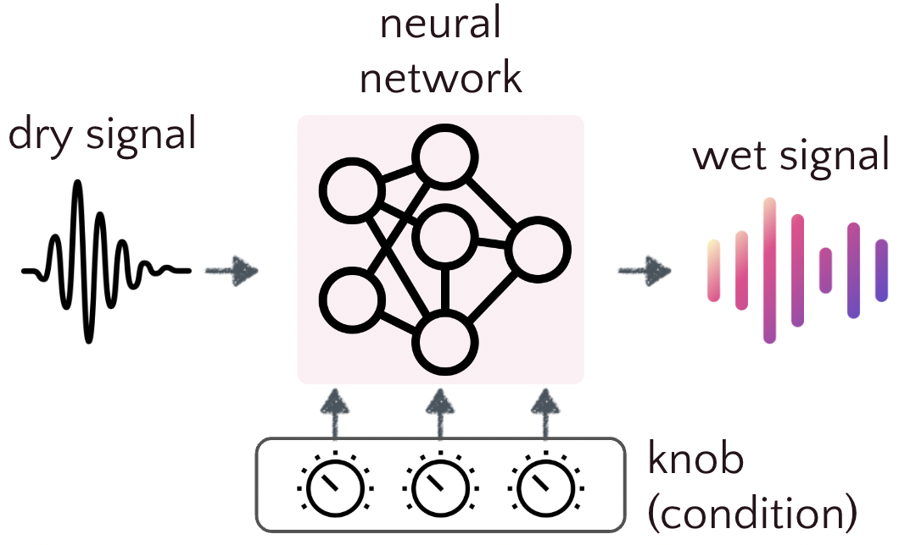

# Dataset
This document describe how to prepare the dataset to match the data template pyneuralfx expected.

## 1. Expected Data Template 

There are two different types of data template, the one is for ```snapshot modeling```, and the other is for ```full modeling```.

---
```snapshot modeling```: the model emulates only the specific settings of the audio effect. This approach requires just two files: the input dry signal and the output wet signal.




---

```full modeling```: the model emulates the complete behavior of the audio effect, typically including all adjustable parameters. This approach requires collecting numerous input-output audio pairs. Each pair represents the relationship between the input and output audio files, demonstrating the effect's behavior under specific parameter settings.




### Snapshot modeling scenario

Prepare the input-output audio pair that you aim to emulate. 
Input file is the dry signal, and the output file is the wet signal. For example: 

```
input file: /path/to/input/dry/signal.wav
output file: /path/to/output/wet/signal.wav
```

#### Steps 

* First, modify the configuration in the `preprocess/preproc_snapshot.py`
```python
'''in preprocess/preproc_snapshot.py'''

# ...
# ==================================================== #
    # configuration
    # ==================================================== #
    # Determine the train/valid/test ratio
    train_ratio = 0.6
    valid_ratio = 0.1 
    test_ratio = 0.3 

    # Determine the snapshot audio pair 
    path_to_x = /path/to/input/dry/signal.wav
    path_to_y = /path/to/output/wet/signal.wav

    # Determine where to save the data split to train/valid/test 
    path_dir_to_save =  /path/to/save/splitted/signal
# ...
```
* Run the `preprocess/preproc_snapshot.py` 
* Final output file structure will be 
```
path_dir_to_save        
├─ train  
│  ├─ train_x.wav 
│  ├─ train_y.wav
├─ valid 
│  ├─ valid_x.wav 
│  ├─ valid_y.wav
├─ test      
│  ├─ valid_x.wav 
│  ├─ valid_y.wav
```
* Finished, next step will be modify the training configuration files 

### Full modeling scenario
Organized the dataset as the following (or similar) structure. (If you are using the dataset we support, then you can find the provided preprocess file to achieve the following structure)

```
frame_work         
├─ data                   
│  ├─ dataset_name 
│  │  ├─  train
│  │  │  ├─  x
│  │  │  │   ├─ x_d0_t0.wav
│  │  │  │   ├─ ...
│  │  │  ├─  y
│  │  │  │   ├─ y_d0_t0.wav
│  │  │  │   ├─ ...
│  │  ├─  valid
│  │  │  ├─  x
│  │  │  │   ├─ x_d0_t0.wav
│  │  │  │   ├─ ...
│  │  │  ├─  y
│  │  │  │   ├─ y_d0_t0.wav
│  │  │  │   ├─ ...
│  │  ├─  test
│  │  │  ├─  x
│  │  │  │   ├─ x_d0_t0.wav
│  │  │  │   ├─ ...
│  │  │  ├─  y
│  │  │  │   ├─ y_d0_t0.wav
│  │  │  │   ├─ ...
```

#### Data Preparation: File Naming Convention

Each input file should follow a specific naming pattern to encode important information about the audio signal and effect parameters. The general format is:

```
signal_param1_param2.wav
```

#### Breakdown of the naming components

1. **Signal Type:**
   - `x` denotes a dry (input) signal
   - `y` denotes a wet (output) signal

2. **Effect Parameters:**
   - Each parameter is represented by a letter followed by its value
   - Parameters are separated by underscores (`_`)

3. **File Extension:**
   - Use `.wav` for audio files (other is not tested now)

#### Example

```
x_d0_t0.wav
```

In this example:
- `x` indicates this is a dry signal
- `d0` represents the distortion knob set to 0
- `t0` represents the tone knob set to 0

#### Naming Rules

1. Use lowercase letters for all components
2. Separate each piece of information with an underscore (`_`)
3. For effect parameters, use a single letter followed by the parameter value
4. Maintain consistency in the order of parameters across all files

#### Parameter Encoding

| Effect     | Encoding | Examples |
|------------|----------|----------|
| Distortion | `d`      | d0, d5, d10 |
| Tone       | `t`      | t0, t5, t10 |

This naming convention allows for easy identification of signal type and effect settings, facilitating efficient data organization and processing.


### 2. Configuration
Before training, remember to change the dataset path in the configuration file, which can be founder under `configs` folder and stored in `.yml` format.

#### Snapshot modeling example 
```
data:
  buffer_size: 8192
  sampling_rate: 44100
  inp_channels: 1
  out_channels: 1
  train_x_path: path_dir_to_save/train/train_x.wav
  train_y_path: path_dir_to_save/train/train_y.wav
  valid_x_path: path_dir_to_save/valid/valid_x.wav
  valid_y_path: path_dir_to_save/valid/valid_y.wav
  test_x_path: path_dir_to_save/test/test_x.wav
  test_y_path: path_dir_to_save/test/test_y.wav
```
#### Full modeling example 
```
data:
  buffer_size: 2048
  sampling_rate: 48000
  inp_channels: 1
  out_channels: 1
  num_conds: 2
  norm_tensor: [[0, 4], [0, 4]]
  train_path: frame_work/data/dataset_name/train
  valid_path: frame_work/data/dataset_name/valid
  test_path: frame_work/data/dataset_name/test
```